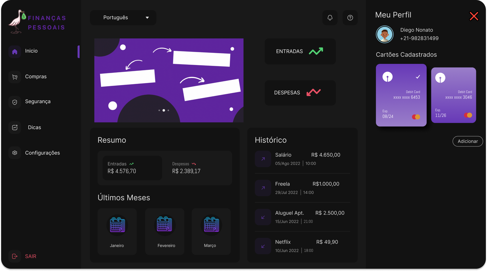

# Finanças Pessoais 

<!---Esses são exemplos. Veja https://shields.io para outras pessoas ou para personalizar este conjunto de escudos. Você pode querer incluir dependências, status do projeto e informações de licença aqui--->


##  🖋️  Objetivo do Projeto<br>

Este é um projeto utilizado no curso de Sistemas para Internet da PUC Minas

<a href=" https://www.pucminas.br/PucVirtual/Graduacao/Paginas/Sistemas-para-Internet-Tecnologo.aspx?moda=1&curso=441&local=7c032ce9-43f6-4571-b72e-674be76a5b62
">Sistemas para Internet - Tecnólogo</a>

## Sobre o programa
> Com a quantidade de contas digitais e cartões de crédito que uma pessoa pode ter atualmente, somado ao aumento dos preços, é comum que a pessoa acabe perdendo o controle de onde vem e pra onde vai o seu dinheiro. Com isso, precisamos de um programa que permita esta pessoa a registrar seus gastos, contas fixas, assinaturas, saldos em contas digitais, cartões de crédito para ter uma visão unificada de como estão suas contas. Além disso, o programa pode auxiliar a pessoa em sua vida financeira com dicas de como pode economizar dinheiro como identificar um número excessivo de assinaturas de streaming, sugerir o cancelamento de cartões de crédito com anuidade que não estejam sendo utilizados, ou até sugerir um orçamento para cada categoria e indicar quando está ultrapassando. Para melhorar o engajamento da pessoa com as suas finanças, uma abordagem gamificada pode ser utilizada com objetivos e recompensas. 



> O programa pode auxiliar a pessoa em sua vida financeira com dicas de como pode economizar dinheiro como identificar um número excessivo de assinaturas de streaming, sugerir o cancelamento de cartões de crédito com anuidade que não estejam sendo utilizados, ou até sugerir um orçamento para cada categoria e indicar quando está ultrapassando. Para melhorar o engajamento da pessoa com as suas finanças, uma abordagem gamificada pode ser utilizada com objetivos e recompensas

> Finanças, dinheiro e investimentos estão entre os assuntos mais comentados atualmente. Na internet fica fácil encontrar vídeos, infográficos, blogs, sites, podcasts e perfis nas redes sociais que disseminam o conhecimento a respeito da educação financeira. 

> Porém, é de amplo conhecimento que o brasileiro possui um tabu em torno do tema. Muitos admitem ser descontrolados financeiramente e desorganizados quando o assunto é a gestão do orçamento. Seja ele familiar ou individual. 

### Ajustes e melhorias

O projeto ainda está em desenvolvimento e as próximas atualizações serão voltadas nas seguintes tarefas:

- [x] Fluxo do usuário ``UserFlow``
- [x] Wireframe - ``Figma``
- [x] Desenvolver páginas web estáticas - ``HTML``
- [x] Desenvolver estilos de páginas web - ``CSS``
- [x] Desenvolver páginas web dinâmicas - ``Javascript``
- [ ] Utilizar API da web no lado do cliente (client-side) ``localStorage com javascript``
- [ ] Aplicar os princípios associados à direção de arte em produções multimídia na construção de páginas web ``UI/UX``

## 💻 Pré-requisitos

Antes de começar, verifique se você atendeu aos seguintes requisitos:
<!---Estes são apenas requisitos de exemplo. Adicionar, duplicar ou remover conforme necessário--->
* Você instalou a versão mais recente de `Navegadores de internet (Google Chrome, Opera, Brave, Mozilla Firefox)`
* Você tem uma máquina `<Windows / Linux / Mac>`.
* Você leu todo o `README.MD`.

## 🚀 Instalando o Finanças Pessoais

Para instalar o ``Finanças Pessoais``, siga estas etapas:

Windows, Linux e macOS:
```
abra seu editor de código preferido e no console digite por git clone <linkDoProjeto>
```

## ☕ Usando o Finanças Pessoais

Para usar o ``Finanças Pessoais``, siga estas etapas:


```
abra com o auxilio da extensão LIVE SERVER disponivel abaixo: 
``` 
<a href="https://marketplace.visualstudio.com/items?itemName=ritwickdey.LiveServer">Live Server</a>


## 📫 Contribuindo para o Finanças Pessoais


1. Bifurque este repositório.
2. Crie um branch: `git checkout -b <nome_branch>`.
3. Faça suas alterações e confirme-as: `git commit -m '<mensagem_commit>'`
4. Envie para o branch original: `git push origin <nome_do_projeto> / <local>`
5. Crie a solicitação de pull.

Como alternativa, consulte a documentação do GitHub em [como criar uma solicitação pull](https://help.github.com/en/github/collaborating-with-issues-and-pull-requests/creating-a-pull-request).

## 🤝 Colaboradores

Agradecemos às seguintes pessoas que contribuíram para este projeto: <br><br>``Grupo 01``

<table>
  <tr>
    <td align="center">
      <a href="#">
        <br>
        <sub>
          <b>Cleide Nascimento</b>
        </sub>
      </a>
    </td>
    <td align="center">
      <a href="#">
        <br>
        <sub>
          <b>Diego Nonato</b>
        </sub>
      </a>
    </td>
    <td align="center">
      <a href="#">
        <br>
        <sub>
          <b>João Leite</b>
        </sub>
      </a>
    </td>
    <td align="center">
      <a href="#">
        <br>
        <sub>
          <b>Maria Paula Mangabeira</b>
        </sub>
      </a>
    </td>
  </tr>
</table>


## 📝 Licença

Esse projeto está sob licença. Veja o arquivo [LICENÇA](LICENSE.md) para mais detalhes.

[⬆ Voltar ao topo](#nome-do-projeto)<br>